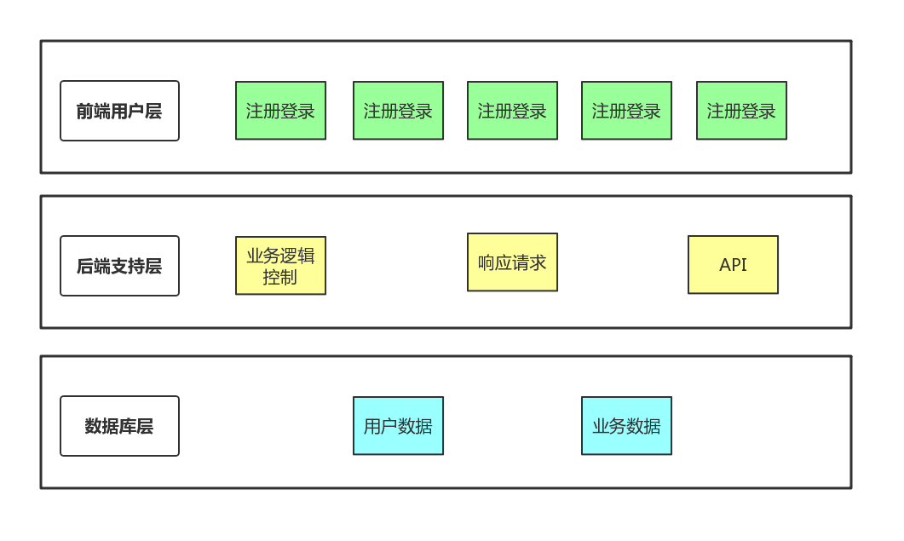

说明：本项目为系统分析与设计项目
## Contents
1. 技术选型理由
2. 架构设计
3. 模块划分
4. 所用软件设计技术以及对应模块代码
5. 其他设计
    - 数据库设计
    - 界面设计

 ## 1. 技术选型及理由
 - 我们的项目是一个基于微信小程序的任务发布平台，我们只需要用微信扫描二维码进行注册登录即可进入平台。前端技术选用原生的微信小程序开发语言，后端技术选用python的flask框架。
- 前端技术我们采用wepy框架进行开发；wepy借鉴了Vue.js的语法风格以及功能特性，同时wepy支持组件化开发以及支持promise，性能优化方面比原生小程序开发语言好。
- 后端技术我们采用python的flask框架，不仅继承了python的语法简洁明了，还保持核心功能的简单而易于扩展。
- 数据库我们采用flask中扩展的Flask-SQLAlchemy关系型数据库框架，简化了我们的操作，开发效率得到了极大提升。

---

 ## 2. 架构设计
 架构分为三层：
- **前端用户层：** 用户通过微信小程序于我们的系统进行交互，交互界面提供注册登录、发布任务、接收任务、查询任务、问卷填写功能。
- **后端支持层：** 后端对系统的业务逻辑进行处理和控制，响应前端用户层的请求，实现各个模块的功能和提供接口。
- **数据库层：** 使用flask的SQLAlchemy对用户数据和业务数据进行可持久化的读取和存储。

---
 ## 3. 模块划分
 #### 用户注册模块  
 

#### 用户登录模块  
  

#### 发布任务模块  
  

#### 接受任务模块  
  
#### 管理模块                 
           

 ## 4. 所用软件设计技术以及对应模块代码
### 4.1 设计模式: MVVM模式

   - View, 在template标签中

     ```
     <template>
       <view style="position: fixed; height: 100%; width: 100%;">
         <mynavbar title="我的信息" lefttext="" leftarrow="false" @tap="gotoMyDetail"></mynavbar>
         <!-- 主体 -->
         <van-person-info avatarurl="{{userinfo.avatar}}" username="{{userinfo.username}}" studentID="{{userinfo.id}}" school="{{userinfo.school}}" @tap="tap()" login="{{islogin}}"></van-person-info>
         <van-cell title="我的发布" is-link url="myTask?type=publish"/>
         <van-cell title="我的接单" is-link url="myTask?type=receive"/>
         <van-cell title="我的钱包" is-link url="myWallet"/>
         <van-cell title="我的设置" is-link url="mySetting"/>
         <!-- 底部导航栏 -->
         <mytabbar></mytabbar>
       </view>
     </template>
     ```

     

   - ViewModel, 数据和View中的数据双向绑定

     ```
     data = {
           userinfo: {},
           islogin: false
         }
     ```

     

   - Model

     ```
     components = {
           mytabbar: MyTabbar,
           mynavbar: MyNavBar
         }
     ...
     methods = {
           tap() {
             if (this.islogin) {
               console.log("click");
               wepy.navigateTo({
                 url: 'myInfoDetail'
               });
             }
             else {
               var _this = this
               wx.navigateTo({
                 url: 'login'
               })
             }
           }
         }
     ```

     

### 4.2 面向对象编程

   - 每个页面或组件都是一个类, 其中封装了数据和方法

   ```
   export default class MyInfo extends wepy.page {
       components = {
         mytabbar: MyTabbar,
         mynavbar: MyNavBar
       }
       data = {
         userinfo: {},
         islogin: false
       }
       methods = {
         tap() {
           if (this.islogin) {
             console.log("click");
             wepy.navigateTo({
               url: 'myInfoDetail'
             });
           }
           else {
             var _this = this
             wx.navigateTo({
               url: 'login'
             })
           }
         }
       }
       onShow() {
         this.$broadcast('changeActive', "2");
         this.userinfo = this.$parent.globalData.userInfo;
         console.log(this.userinfo);
         // console.log(userInfo)
         this.islogin = this.$parent.globalData.loginData.state;
         console.log("islogin: " + this.islogin)
         this.$apply()
       }
     }
   ```

   ```
   export default class Taskitem extends wepy.component {
       props = {
         titem: {}
       }
       components = {
   
       }
       data = {
   
       }
       methods = {
         showDetail() {
           var myurl = "taskDetail"
           myurl += "?id=";
           myurl += this.titem.id;
           console.log(myurl);
           wepy.navigateTo({
             url: myurl
           });
         }
       }
       onLoad() {
   
       }
     }
   ```

   - 在app中, 页面和组件都将会被实例化

   ```
   export default class extends wepy.app {
     config = {
       pages: [
         'pages/mainPage',
         'pages/createQuery',
         'pages/taskDetail',
         'pages/publishTask',
         'pages/editQuery',
         'pages/queryDetail',
         'pages/myInfo',
         'pages/taskCategory',
         'pages/myTask',
         'pages/myWallet',
         'pages/mySetting',
         'pages/myInfoDetail',
         'pages/myEditInfo',
         'pages/editMyTask',
         'pages/login',
         'pages/register',
         'pages/searchResult',
         'pages/receiverDetail'
       ], 
       ...
       usingComponents: {
         'van-button': '../components/van/button/index',
         'van-cell-group': '../components/van/cell-group/index',
         'van-cell': '../components/van/cell/index',
         'van-row': '../components/van/row/index',
         'van-col': '../components/van/col/index',
         'van-field': '../components/van/field/index',
         'van-popup': '../components/van/popup/index',
         'van-toast': '../components/van/toast/index',
         'van-search': '../components/van/search/index',
         'van-tabbar': '../components/van/tabbar/index',
         'van-tabbar-item': '../components/van/tabbar-item/index',
         'van-icon': '../components/van/icon/index',
         'van-area': '../components/van/area/index',
         'van-tab': '../components/van/tab/index',
         'van-tabs': '../components/van/tabs/index',
         'van-nav-bar': '../components/van/nav-bar/index',
         "van-swipe-cell": '../components/van/swipe-cell/index',
         'van-cell-for-taskItem': '../components/van/cell_for_TaskItem/index',
         'van-person-info': '../components/van/person-info/index',
         'van-picker': '../components/van/picker/index',
         'van-cell-for-infodetail': '../components/van/cell_for_InfoDetail/index',
         'van-cell-for-taskDetail': '../components/van/cell_for_taskDetail/index',
         'van-progress': '../components/van/progress/index',
         'van-datetime-picker': '../components/van/datetime-picker/index',
         'van-tag': '../components/van/tag/index',
         'van-dialog': '../components/van/dialog/index',
         'van-loading': '../components/van/loading/index',
         'van-toast': '../components/van/toast/index',
         'van-action-sheet': '../components/van/action-sheet/index'
       },
       ...
   ```

---
 ## 5. 其他设计
### 数据库设计
- ER图
    
#### user 表
- user使用id来进行表示，该id是学生id，我们的目标群体就是本校学生。
- user表用来存储所有用户的信息
#### receiver表
- 根据er图逻辑设计的user的类。每个receiver有自己的独立id，同时用于一个uid也就是user表中id作为外键。
- 当user跟Task发生关系是，就会有一个对应的receviver生成，成为该user在该Task背景下的接收者。
#### Task表
- 每个Task会记录下发布人的id、接收者的id，以及其他相关的信息（例如时间、报酬、任务内容等）
- Task中会包含Template，用作问卷的模板，如果这个任务没有设计问卷内容，那么Template置空
- Task中包含了image，用来存储任务图片的编码
- Task中拥有receviers数组，来记录参与这个任务的接收者
- Task中使用type来区分任务类型
#### Template表
- 每个Template都依赖于Task，是一个弱实体集
- Task拥有questions数组来记录问卷问题
- Task拥有options数组来记录问题选项
- Task拥有types数组来记录对应问题的类型，支持单选题，多选题和问答题
---
### 界面设计
- 已将 UI 原型导出为 html 静态，放置在 [原型图HTML文件](https://github.com/sysu-makemoney/MakeMoney/tree/master/Documents/%E5%8E%9F%E5%9E%8B%E5%9B%BEHTML%E6%96%87%E4%BB%B6) 的一个子目录下

#### UI 界面原型
##### 1. 任务广场（首页）


##### 1.1 任务详情（接受任务）
- 点击任务即可查看任务详情，详情页面可接受任务。

###### 1.2 任务分类（线上任务）
- 首页点击线上或线下任务即可通过分类筛选任务，分类界面还可以再进行进一步筛选。

###### 1.3 搜索任务
- 点击主页搜索框即可进入搜索页面，可查看搜索历史。


##### 2. 任务发布
###### 2.1 选择任务类型
- 首页点击底部加号即可进入发布任务类型选择。

###### 2.2 填写任务详情
- 选择类型后即可填写其他任务详细信息。

###### 2.3 创建问卷
- 对于问卷类型的任务，需要跳转到问卷创建界面进行问卷发布。

- 在上图右下角选择题型后即可创建问题，下图为单选题创建界面。

##### 注册&登录
###### 登录界面

###### 注册界面

##### 个人页
###### 未登录

##### 已登陆

###### 我的发布（与我的接单相同）


---


